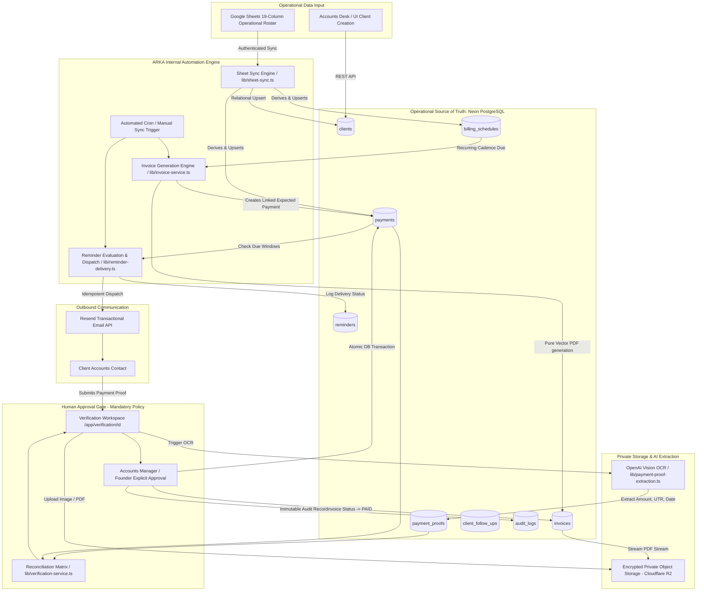

# ARKA Finance & Accounts Operations System Architecture

ARKA Accounts is an end-to-end, production-grade financial operations platform designed for agency and corporate accounts teams. It orchestrates client billing schedules, automated PDF invoice generation, payment tracking, multi-window reminder dispatch, AI-assisted payment proof extraction, deterministic verification matrix reconciliation, and an atomic human approval gate.

The application operates with **Neon PostgreSQL** as its sole operational source of truth. Google Sheets serves as an external operational input and collaborative synchronization source.

---

## 1. System Topology & Data Flow

---

## 2. Core Architectural Pillars

### I. Neon PostgreSQL as Operational Source of Truth
- Built on PostgreSQL with Drizzle ORM (`numeric(14,2)` precision for all financial balances and amounts).
- Explicit relational models for:
  - `clients`: Complete operational profile (GSTIN, legal name, payment terms, billing cadence, contacts).
  - `billing_schedules`: Contracted recurring fees, billing cadences (MONTHLY, QUARTERLY, BI_ANNUAL, ANNUAL, MILESTONE), next billing dates.
  - `invoices`: Sequential, gap-free numbering (`INV-YYYY-XXXX`), tax computations (CGST/SGST/IGST), subtotal, total amount, PDF storage keys.
  - `payments`: Lifecycle tracking (`PENDING`, `UPCOMING`, `DUE_TODAY`, `OVERDUE`, `PAYMENT_SUBMITTED`, `VERIFIED`, `MANUAL_REVIEW`, `PAID`, `REJECTED`).
  - `payment_proofs`: Storage reference, file metadata, raw OCR payload, extracted amount, extracted date, extracted UTR/reference number.
  - `reminders`: Multi-window logs, delivery channel status, Resend IDs.
  - `client_follow_ups`: Collections notes, overdue escalation logs, assigned collector.
  - `audit_logs`: Immutable security log recording user ID, IP address, timestamp, previous state, and next state for every monetary transition.

### II. Pure Vector PDF Engine (`lib/invoice-pdf.ts`)
- Implemented with pure JS `pdf-lib` without browser (Puppeteer) or native OS dependencies.
- Compatible across Node.js and Cloudflare Workers runtime.
- Emits crisp, clean corporate vector invoices with tax breakdowns, legal disclosures, bank details, and compliant WinAnsi-encoded currency strings (`INR`).
- Stored exclusively in private object storage (R2).

### III. Internal Automation Engine (`lib/automation-engine.ts`)
- **No external third-party middleware (e.g. n8n).**
- Self-contained automation orchestrator invoked via:
  - Secured HTTP endpoint: `POST /api/automation/run` authorized via Bearer `CRON_SECRET`.
  - In-app interactive trigger available to Founders and Accounts Managers in the dashboard topbar and Billing desk.
- Automated jobs include:
  1. `invoice.generate`: Evaluates active billing schedules due today, generates vector PDFs, creates linked expected payments, updates next billing dates.
  2. `payment.lifecycle.refresh`: Recomputes payment aging against current date (`Asia/Kolkata` timezone), transitioning `PENDING` payments to `UPCOMING`, `DUE_TODAY`, or `OVERDUE`.
  3. `reminder.process`: Evaluates reminder eligibility windows (-3 days, due date, +3 days overdue, +7 days overdue) and idempotently delivers transactional notifications.
  4. `sheet.sync`: Runs bidirectional validation and ingestion from Google Sheets.
  5. `followup.check`: Flags severely delinquent accounts for urgent collections follow-up.

### IV. Private Document Storage (`lib/storage.ts`)
- Receipts, bank slips, and generated invoices are never stored in public buckets.
- Development uses an in-memory `LocalStorageProvider`; production binds to Cloudflare R2 (`BUCKET`).
- Documents are streamed via authenticated internal endpoints (`GET /api/invoices/:id/pdf`, `GET /api/payments/:id/proof/:proofId`).
- Access is strictly gated by session cookies or RBAC roles.

### V. Deterministic Reconciliation & Atomic Human Approval Gate
- **Strict Human Approval Policy:** No OCR result or proof upload can automatically set a payment or invoice to `PAID`.
- AI Vision OCR extracts structured metadata (amount, UTR, date, payer).
- The reconciliation engine compares extracted data against expected payment records:
  - Exact match (`MATCH`)
  - Amount mismatch (`AMOUNT_MISMATCH`)
  - Date anomaly (`DATE_MISMATCH`)
  - Duplicate UTR / reference collision check (`DUPLICATE_UTR`)
- When discrepancies exist, the record is placed in `MANUAL_REVIEW`.
- Only an Accounts Manager or Founder can execute the atomic transaction that settles the payment to `PAID`, marks the associated invoice as `PAID`, updates audit logs, and dispatches settlement notifications.

---

## 3. Security & Operational Integrity
- **Authentication & RBAC:** Session cookies with cryptographic token verification, constant-time buffer comparisons, active user verification, and three discrete role tiers (`FOUNDER`, `ACCOUNTS_MANAGER`, `ACCOUNT_MANAGER`).
- **Cron Protection:** Timing-safe comparison on `CRON_SECRET` Bearer header.
- **Fail-Safe Integrity:** When external services (OpenAI, Resend, Google Sheets) are unconfigured or fail, the platform gracefully logs diagnostics and falls back to safe manual review queues without crashing or falsifying business state.
