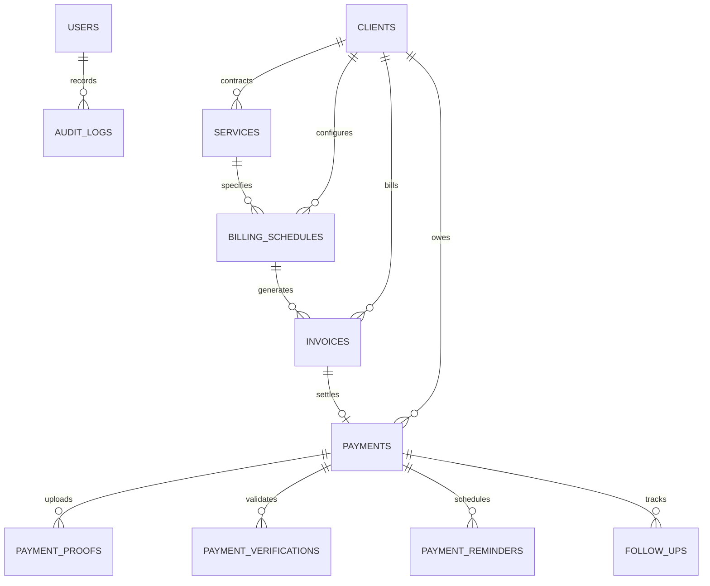

# ARKA Operations: Database Architecture & Domain Model

## 1. Production Database Engine: Neon Serverless PostgreSQL

The application exclusively targets **Neon PostgreSQL** via `drizzle-orm/neon-http` and `@neondatabase/serverless`. All schemas are defined in [`db/schema.ts`](db/schema.ts) using `pg-core`. Currency values use `numeric(14,2)` for financial precision.

- **Connection**: Driven by the server-only `DATABASE_URL` environment variable.
- **Migration History**: Managed strictly through PostgreSQL migrations under [`drizzle-pg/`](drizzle-pg/):
  - `0000_arka_init.sql`: Core schema (users, clients, payment schedules, payments, proofs, verifications, reminders, audit logs)
  - `0001_security_and_indexes.sql`: Security indexes and UTR unique constraints
  - `0002_reminder_windows.sql`: Multi-window notification tracking
  - `0003_verification_reupload.sql`: Human verification re-upload workflows
  - `0004_arka_accounts_expansion.sql`: Invoices, line items, automation jobs, expanded client profiles, payment-to-invoice linkage

---

## 2. Core Entities & Relationships

### 1. `clients`
- Legal name, company trade name, client code (`CLI-XXX`).
- Contact person, email, phone, billing address, city, state.
- GST identification number (`gst_number`), payment terms in days (`payment_terms_days`).
- Status (`ACTIVE`, `INACTIVE`), account owner ID.

### 2. `services`
- Contracted services linked to clients (e.g. `Retainer - Cloud Engineering`).
- Base pricing, currency, descriptions, and active status.

### 3. `billing_schedules`
- Cadence: `MONTHLY`, `QUARTERLY`, `ONE_TIME`.
- Invoice generation day of month (1-28), payment terms in days.
- Contract period (`billing_start_date`, `billing_end_date`).
- Automation flags: `auto_generate_invoice` (triggers daily PDF rendering), `auto_send_invoice` (triggers client email delivery).
- Status (`ACTIVE`, `PAUSED`, `CANCELLED`).

### 4. `invoices`
- Unique sequential tax invoice numbering (`INV-YYYY-XXXX`).
- Line items, subtotal, GST (18%), and total amount.
- Due date, issue date, status (`DRAFT`, `SENT`, `PAID`, `OVERDUE`, `VOID`).
- `pdf_storage_key`: Encrypted path to vector PDF stored in Cloudflare R2.
- Direct foreign key reference to `clientId` and `billingScheduleId`.

### 5. `payments`
- Financial receivable record tracking collection lifecycle.
- Linked to `invoice_id` and `client_id`.
- Controlled State Machine:
  - `UPCOMING`: Scheduled future payment.
  - `DUE_TODAY`: Payment due on current Kolkata business date.
  - `OVERDUE`: Past due date without verified settlement.
  - `PROOF_UPLOADED`: Client transfer receipt uploaded.
  - `VERIFYING`: Automated OCR extraction active.
  - `MANUAL_REVIEW`: Discrepancy, missing UTR, or unconfigured OCR provider routed to human desk.
  - `MISMATCH`: Extracted amount differs from expected billing amount.
  - `VERIFIED`: Reconciled by Accounts Manager or Founder.
  - `PAID`: Permanently settled in atomic transaction with invoice.
  - `REJECTED`: Invalid proof rejected with formal reason.

### 6. `payment_proofs`
- Private metadata for uploaded receipts (PNG, JPG, PDF up to 10MB).
- `file_key`: Private storage path (authenticated streaming only; never returns public URLs).

### 7. `payment_verifications`
- Stores deterministic OCR extraction data: extracted amount, payment date, transaction ID, UTR, confidence score, reconciliation result (`AUTO_MATCHED`, `MANUAL_REVIEW`, `MISMATCH`).
- Reviewed by actor ID and timestamp.

### 8. `payment_reminders`
- Reminder windows: `UPCOMING_REMINDER` (3 days before), `DUE_TODAY_REMINDER`, `OVERDUE_REMINDER` (Day 1 overdue), `OVERDUE_FOLLOWUP` (Every 3 days).
- Delivery channel (`EMAIL`, `WHATSAPP`), sent timestamp, status (`PENDING`, `SENT`, `FAILED`), and diagnostic error messages.

### 9. `follow_ups`
- Manual and communication records: `PHONE_CALL`, `WHATSAPP_MESSAGE`, `EMAIL_FOLLOWUP`, `PAYMENT_PROMISE`.
- Scheduled follow-up dates, promised amounts, and completion status.

### 10. `automation_jobs`
- Execution log for scheduled internal jobs (`invoice.generate`, `payment.lifecycle.refresh`, `reminder.process`, `sheet.sync`, `followup.check`).
- Duration, success count, failure count, and diagnostic payloads.
