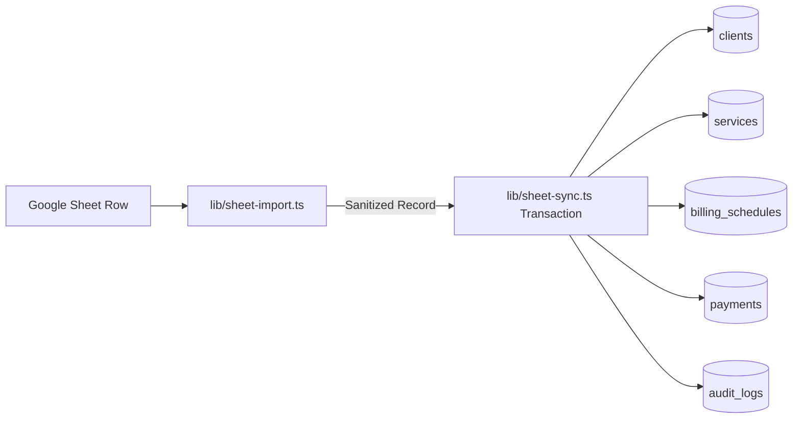

# ARKA Operations: Google Sheets Operational Data Sync Guide

This document defines the production synchronization contract between Google Sheets and the ARKA Finance & Accounts Engine.

---

## 1. Architectural Role: Google Sheets vs Neon PostgreSQL

- **Google Sheets** serves as the **operational input and collaborative data-entry surface** for business and account managers.
- **Neon PostgreSQL** is the **operational database and source of truth**. Once synced into ARKA:
  - Invoices are generated with unique serial numbers (`INV-YYYY-XXXX`).
  - True vector PDF documents are created via `pdf-lib` and stored privately.
  - Payment records maintain atomic state (`UPCOMING` -> `DUE_TODAY` -> `OVERDUE` -> `PROOF_UPLOADED` -> `VERIFYING` -> `VERIFIED` -> `PAID`).
  - Follow-up communications, reminders, and audit trails are persisted.
  - Google Sheets receives status updates and reference mappings.

---

## 2. Supported Spreadsheets & Connection Modes

ARKA supports two connection modes:

### Mode A: Link-Shared Spreadsheet (Instant, Zero Setup)
For team spreadsheets set to **"Anyone with the link can view"** (e.g. `https://docs.google.com/spreadsheets/d/1k1SwuFxywG67CHJWAe5vq7yDwDpBfk-0H8J2vxZ9JQ8/edit?usp=sharing`):
- Configure `GOOGLE_SHEET_ID` with the spreadsheet ID or full URL.
- No Google Cloud Console project or IAM service account key required.
- ARKA automatically streams and parses the sheet via Google's CSV export endpoint.

### Mode B: Enterprise Service Account (Private Spreadsheets)
For private spreadsheets restricted to internal domains:
- Provide `GOOGLE_SERVICE_ACCOUNT_EMAIL` and `GOOGLE_SERVICE_ACCOUNT_PRIVATE_KEY`.
- Connects securely using Google Sheets API v4 with JWT authentication.

---

## 3. Supported Sheet Formats & Schemas

ARKA features a dual-schema normalizer supporting both standard comprehensive operational tables and agency monthly billing rosters.

### Schema 1: Agency Monthly Billing Roster (9 Columns)
Used by ARKA agency operations:

| Column Header | Accepted Aliases | Data Type | Notes |
| :--- | :--- | :--- | :--- |
| **SL. NO.** | `sl_no`, `index` | Number | Row sequential counter |
| **CLIENTS NAME** | `Client Name`, `Client` | String | Primary client/brand name (e.g. `Animal Gym`, `FMA`) |
| **INVOICE NO.** | `Client Code`, `Reference` | String | Client identifier / invoice reference code (e.g. `AA`, `IR`) |
| **INVOICE DATE** | `Billing From`, `Date` | Date (`DD.MM.YYYY` / `DD/MM/YYYY`) | Billing period start or invoice issue date |
| **INVOICE DUE DATE** | `Due Date` | Date (`DD.MM.YYYY` / `DD/MM/YYYY`) | Payment collection deadline (e.g. `05.10.2026`) |
| **AMOUNT PAYABLE** | `Amount`, `Billing Amount` | Currency (`₹`, `,`) / Number | Contracted payable amount (optional/pending fallback to 0.00) |
| **PAYMENT STATUS** | `Payment State` | String | Current payment status |
| **AMOUNT BALANCE** | `Balance` | Currency / Number | Remaining balance |
| **STATUS** | `status` | String | Client/Schedule status (`ACTIVE`, `PAUSED`, `CANCELLED`) |

### Schema 2: Full Enterprise 19-Column Schema
For comprehensive client profiling:
- `Client ID`, `Client Name`, `Company Name`, `Contact Person`, `Email`, `Phone`, `Address`, `City`, `State`, `GST Number`
- `Service`, `Service Description`, `Billing Type`, `Billing Frequency`, `Billing Amount`, `Currency`
- `Invoice Generation Day`, `Payment Terms Days`, `Billing Start Date`, `Billing End Date`, `Due Date`, `Status`, `Source Reference`

---

## 4. Date & Currency Normalization

- **Date Formats**: Automatically recognizes dot-separated (`DD.MM.YYYY`, e.g. `01.10.2026`), slash-separated (`DD/MM/YYYY`), and ISO (`YYYY-MM-DD`).
- **Payment Terms**: Automatically computes payment terms in days from `(INVOICE DUE DATE - INVOICE DATE)` when explicit terms are not provided.
- **Invoice Generation Day**: Automatically extracted from the invoice start date.
- **Currency Cleaning**: Cleans INR currency symbols (`₹`), Indian numbering formatting commas (e.g. `1,50,000.00`), and whitespace.
- **Service Name**: When omitted from agency rosters, defaults to `"Retainer Services"`.

---

## 5. Ingestion & Database Upsert Pipeline



1. **Client**: Upserted by `name` or `clientCode`. Preserves existing account owners and historical records.
2. **Service**: Upserted by `(clientId, serviceName)`.
3. **Billing Schedule**: Creates or updates recurring schedules with cadence, expected amounts, and auto-invoice flags.
4. **Payment**: Creates or updates operational payment records. Preserves assigned owners, review statuses, and uploaded receipts.
5. **Audit Trail**: Every synced row writes an immutable `SHEET_SYNC_CREATED` or `SHEET_SYNC_UPDATED` entry to `audit_logs`.

---

## 6. How to Trigger Synchronization

- **From ARKA Web Console**: Click **Sync Google Sheet** in the top navigation bar or from [`/settings`](app/settings/page.tsx).
- **Via API Endpoint**:
  ```bash
  curl -X POST https://your-arka-domain.com/api/sheets/sync \
    -H "Cookie: arka_session=<token>"
  ```
- **Via Internal Automation Cron**:
  ```bash
  curl -X POST https://your-arka-domain.com/api/automation/run \
    -H "Authorization: Bearer <CRON_SECRET>" \
    -H "Content-Type: application/json" \
    -d '{"jobType":"sheet.sync"}'
  ```
