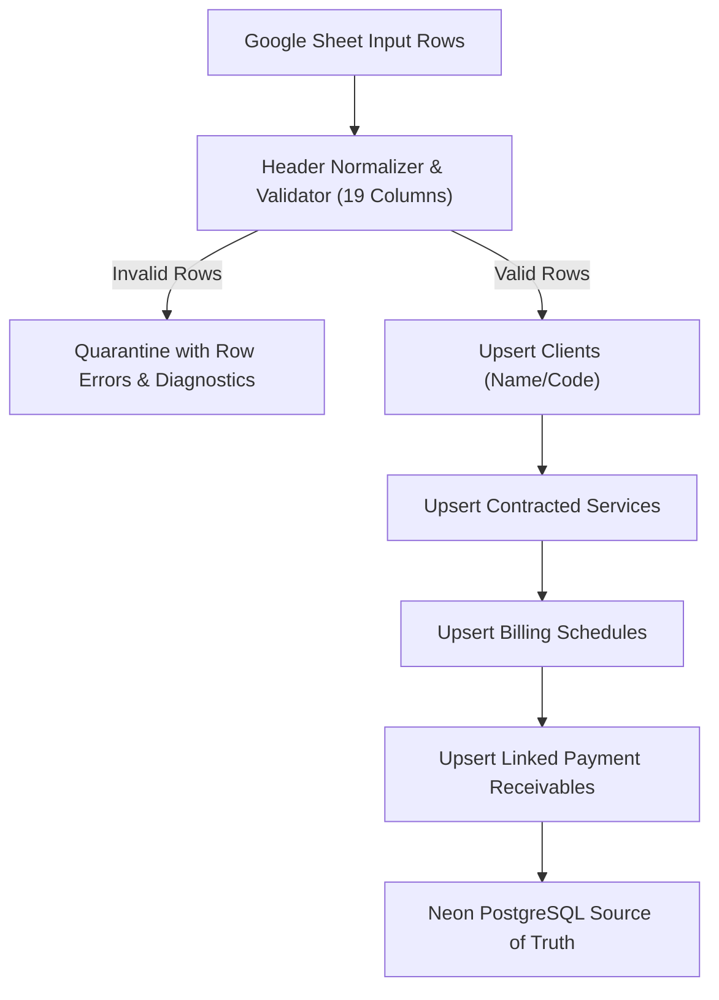
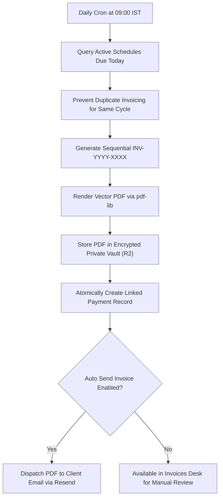
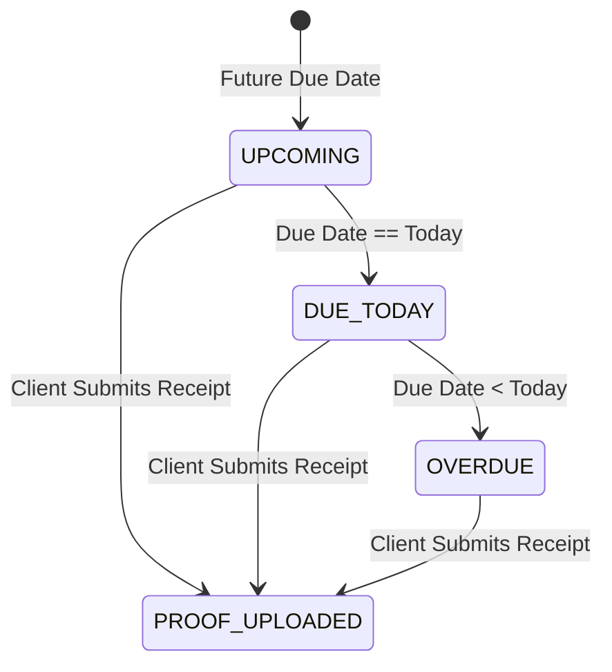
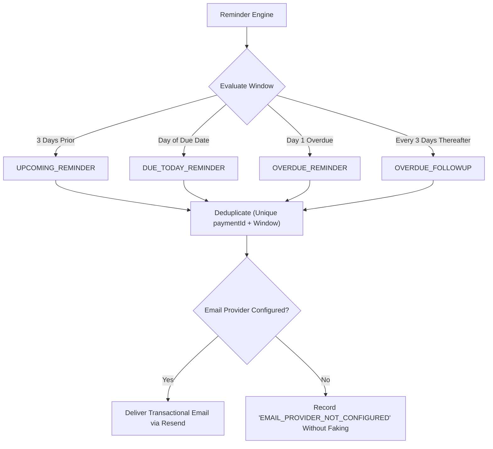
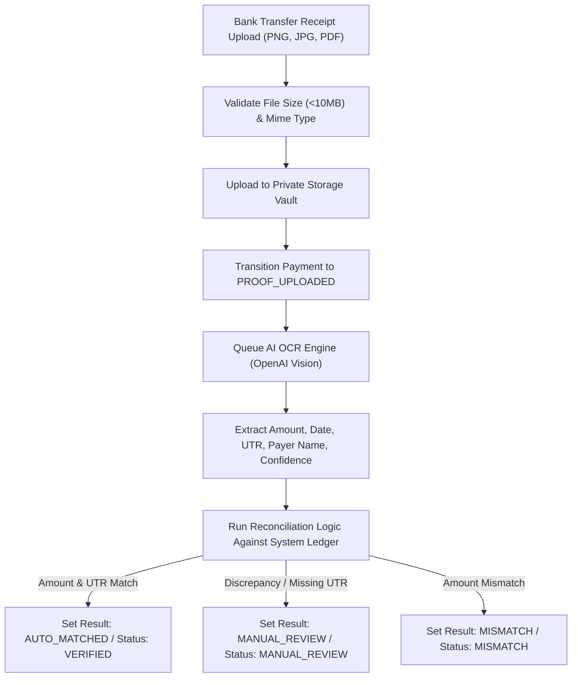
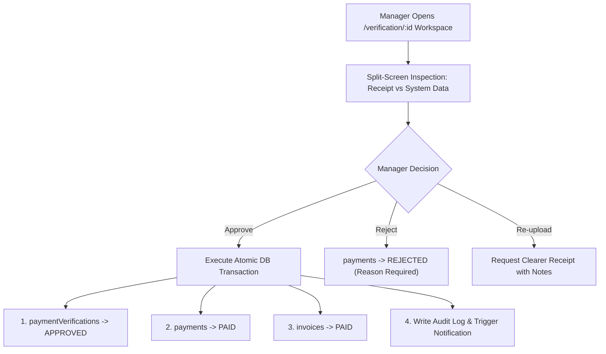

# ARKA Operations: End-to-End Operational Workflows

This document describes the 6 core business operational workflows running inside the ARKA Finance & Accounts Engine.

---

## Workflow 1: Google Sheets Ingestion & Operational Sync

1. **Ingestion**: Sheet sync is invoked via UI button, API endpoint (`POST /api/sheets/sync`), or daily scheduled cron.
2. **Validation**: 19 standard columns are mapped regardless of ordering or column name variations. Currency formatting (`₹`, `INR`, commas, trailing spaces) is automatically sanitized.
3. **Upsert Pipeline**:
   - `clients`: Identified by client code or client name. Existing account managers and contact details are retained.
   - `services`: Mapped to `(clientId, serviceName)`.
   - `billing_schedules`: Creates recurring billing profiles with frequency, invoice generation day, and payment terms.
   - `payments`: Upserts payment receivables while preserving existing account owners and uploaded proofs.
4. **Audit**: Logs execution metrics (`created`, `updated`, `skipped`, `failed`) into `sync_logs`.

---

## Workflow 2: Automated Billing & Vector PDF Invoicing

1. **Cycle Matching**: Runs daily in `Asia/Kolkata` timezone to identify schedules where `next_invoice_date <= today`.
2. **Sequential Numbering**: Locks sequence to generate tamper-proof sequential numbers formatted as `INV-YYYY-XXXX`.
3. **Vector PDF Generation**: Uses pure JavaScript `pdf-lib` to render high-fidelity vector PDF invoices complete with client GSTIN, itemized fees, 18% GST calculation, bank transfer instructions, and QR/UPI IDs.
4. **Private Storage**: Stored securely in Cloudflare R2 (`invoices/INV-YYYY-XXXX.pdf`). Public links are never exposed; access is authenticated.
5. **Atomic Payment Record**: A corresponding `payments` record is created and linked (`invoice_id = invoice.id`).

---

## Workflow 3: Payment Lifecycle & Date Transitions

All date derivations strictly use `Asia/Kolkata` (`UTC+05:30`):

1. **`UPCOMING`**: Payment is scheduled for a date in the future.
2. **`DUE_TODAY`**: System evaluates `dueDate === todayInKolkata`.
3. **`OVERDUE`**: Payment has passed `dueDate` without proof of settlement.
4. Status transitions automatically update the linked invoice status.

---

## Workflow 4: Automated Notification & Reminder Cadence

- Reminders are strictly rate-limited and deduplicated against the `payment_reminders` unique window constraint.
- Settled or verified payments are immediately excluded.
- If the email provider is unconfigured, delivery is safely skipped with a clear diagnostic log.

---

## Workflow 5: Proof Upload & Deterministic OCR Extraction

- When AI OCR is unconfigured or in development mode, receipts gracefully route to `MANUAL_REVIEW` with clear diagnostics.
- The system prevents deadlocks in `VERIFYING` state if OCR fails.

---

## Workflow 6: Strict Human Verification & Atomic Approval Gate

> [!IMPORTANT]
> **Strict Policy**: AI OCR extraction is an operational aid. No payment or invoice status can ever transition to `PAID` without explicit confirmation by an Accounts Manager or Founder.

1. **Split-Screen Workspace**: Displays the uploaded proof document alongside the reconciliation matrix (expected vs detected amount, UTR, date, confidence score).
2. **Atomic Approval**: The `VerificationService.approve` transaction atomically updates the verification record to `APPROVED`, the payment to `PAID`, and the linked invoice to `PAID` in one atomic transaction.
3. **Audit Trail**: Every state transition, rejection reason, or re-upload note is permanently recorded with actor ID and timestamp.
